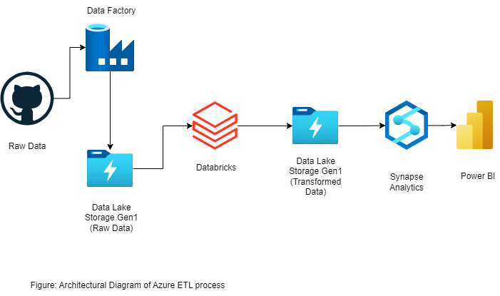

# azure-etl-process

There are few steps involved in this process. 

1. Data is fetched from my Github accound and it is in csv format for simplicity (It is usually fetched using APIS, company's internal source and there are authentication steps involved which cannot be uploaded in Github public repository.)
2. Data is then ingested in the Data Factory.
3. From here, the raw data is send to Data Lake Gen1. 
4. The raw data is then transfered to Azure Databricks where Spark is used for transformation.
5. The transformed data is then kept in the Data Lake Gen1. From here, it is passed to Azure Synapse Analytics.
6. Data Analysis can be done using Microsoft Power BI.

